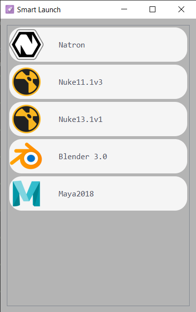

# AppLauncher

[](https://github.com/rameshbabuvfx/AppLauncher/issues)  

### Description.

AppLauncher is a simple software that allows you to launch multiple DCC `Digital Content Creation` applications from single software.

### ScreenShot.



### Installation.

* Clone the [app-launcher](https://github.com/rameshbabuvfx/app-launcher) git repo.

```
https://github.com/rameshbabuvfx/app-launcher.git
```

* Goto dist folder from your cloned repo you can find appLauncher.exe setup file.

```
appLauncher.exe
```
* Double click and install software.


